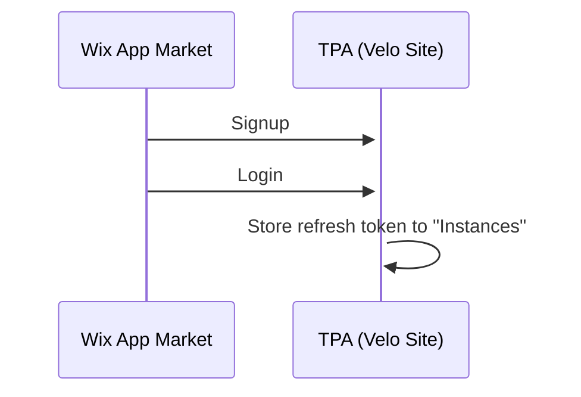
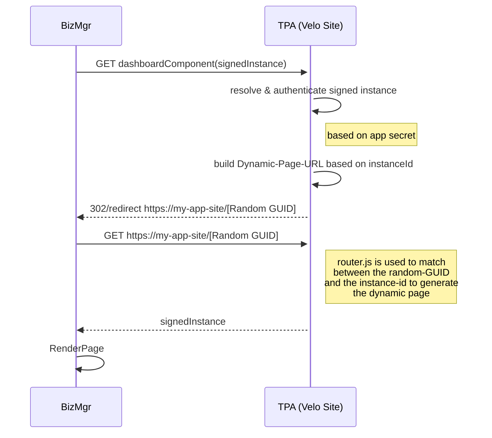

# Velo Based Dashboard TPA


## Overview

TPA-lifecycle allows building Wix Third Party Applications based on Wix Site and harnessing the power of the velo framework for dashboard based TPA's. 
It allows:
-   Zero boilerplate code for app server - in practice work in serverless mode.
-   TPA UI implementation with velo - x10 in velocity - drag and drop experience.
-   Built in support for localization using editor multilingual.
-   Built in velo support for logs
    
## Potential users

-   Internal Wix velo teams that want to scale up solutions
-   External developers - we will make a TPA example out of it - together with the App market team.
    

## Main features

- Complete implementation of oAuth flow  
- Handling TPA lifecycle - Support app install & uninstall  
- Multi tenancy 
- Instance authentication
- Webhooks resolving and authentication 
- Dashboard component TPA (BizMgr screen).
- Page <--> Backend API calls using standard velo page and jsw code files
- Provide access token to call Wix HTTP/REST API
- Secured communication
- Out of the box support for localization using Wix multi-lingual feature
 
 
## Architecture flows

### App installation



 

## Setup

### DB
- Your site needs to have an "Instances" DB collection with the following scheme:
	- instanceId
	- refreshToken
	- signedInstance

### json.config
The package comes with a *config.json* file. You need to edit this file to match your app values.

- appBaseURL --> Take it from your TPA management screen. Example: 'https://kobymaman.wixsite.com/bookings-twilio-app';
- appId --> Take it from your TPA management screen. Example:  '72fdd992-58c5-426f-896a-32ab0a25bcd0';
- appSecret --> Take it from your TPA management screen. Example: 'eb37f614-e0e6-4473-8240-ad1033fc13ef';
- webhookPublicKey --> Take it from the Webhook section of your app. 


	> JSON standard does not support multi line string, you can use [the following tool](https://codepen.io/nosilleg/pen/KdmLPO) to convert the web hook public key to string array.

config.json example:
```
{
    "appBaseURL" : "https://wixbookings.wixsite.com/bookings-checkin",
    "appId": "DEADBEEF-b495-4ac0-84cb-669b97c412e3",
    "appSecret": "DEADBEEF-97df-49b6-8eaf-aad3d0312743",
    "webhookPublicKey": ["-----BEGIN PUBLIC KEY-----","DEADBEEFBgkqhkiG9w0BAQEFAAOCAQ8AMIIBCgKCAQEAv4VeraJgZ2bynIFCqiPK","EZUr/4s44EZWiYd7r6AWmdo4J6chQGmuyTLFk1VweyeWseWF/0fxQQ6keRkzWX8S","N2UCvD0mToYa0LbHyNGd2v/hAnLhVMAeFzpItnfJ+x+C5tZJFYLX1Q7Mdp+xsJuP","Ijo/pFWLEEFUYhoinUSHmxQ+2YD75KsbxnA9DEbDDty1ABRjXxror8PHCMVMOyH3","Ucyz9ZJWlfAvVLMD7RSZrTQ+Uudjf+lPbvYaEE9TqvLWUvpOxxWilrUwpmkfhjAE","kFNOrLqDQmfbPMQljF+NY/Htj6HQRWRgr0jUqhmp74Ahe8nnKZFAybOe4PkP/15+","DQIDAQAB","-----END PUBLIC KEY-----"]
}
```

### HTTP functions
The *http-functions.js* file is where you define your application server end points. 
There are at least 4 end points you need to provide to support the velo app, and while the end points names are for the developer's choice, the implementation needs to use the package implementation. 
|             Purpose             | HTTP Method |       Should Call      |
|:-------------------------------:|:-----------:|:----------------------:|
| oAuth Signup                    | GET         | AppOauth.oauthSignup   |
| oAuth Login                     | GET         | AppOauth.oauthLogin    |
| Handler for App uninstall event | POST        | App.handleAppUninstall |
| Server dashboard page           | GET         | App.returnDynamicPage  |

Here's a typical example for such a file:
```js

import  {App,  AppOauth}  from  '@wixbookings/tpa-lifecycle-2-backend';

export  function  get_signup(request)  {
	return  await AppOauth.oauthSignup(request);
}

export  async  function  get_login(request)  {
	return  await AppOauth.oauthLogin(request);
}
  
export  async  function  post_appUninstalled(request)  {
	return  await App.handleAppUninstall(request);
}
  
export  async  function  get_dashboardComponent(request)  {
	return  await App.returnDynamicPage(request);
}
```

### Router configuration    
A *router.js* file. The router is responsible to handle *instance* requests coming in to your application and allows you to control which dynamic pages will be submitted according to the request's path params.
To better understand the need for a router page take a look at the below diagram showing the flow of serving the application dashboard page.

 #### Serving Dashboard page



A simple router file usually looks like this:
```js
import  {  ok,  notFound  }  from  "wix-router";
import  {  AppDAL  }  from  '@wixbookings/tpa-lifecycle-2-backend';

export  async  function  instance_Router(request)  {

	let  dbItem  =  (await  AppDAL.getItem('Instances',  '_id',  request.path[0],  {  "suppressAuth":  true  }));
	if  (dbItem)  {
		return  ok("dashboard-page",  {  "signedInstance":  dbItem.signedInstance  });
	}
	return  notFound();
}

export  function  instance_SiteMap(sitemapRequest)  {
	return  [];
}
```    

### A router dynamic page “dashboard-page”
The router returns a router page. Your application dashboard page should be created as a router page and you can create other pages as you see fit to handle any application logic. 
See more about routers and dynamic page [here](https://support.wix.com/en/article/velo-about-routers).

> You can change the name of the page, but then you need to change it also in the router.js

### A TPA in your dev account
-   Create your Application
	- Oauth
		- Redirect URL: https://<your domain>/<your-app-domain>/_functions/login
		- App URL: https://<your-app-domain>/_functions/signup
-   Webhook
	- Define a similar function in http.js and link the webhook URL to it
-   Dashboard component should refer to https://<your domain>/_functions/dashboardComponent
    >Note: you can change dashboardComponent / redirect-url / app-url to any name you want, but then you need to change the http.js corresponding function (e.g. get_dashboardComponent)

  
## Security

The following needs to be done in order to keep the app secured:

-   The infrastructure (TPA & DAL) “Instances” collection must remain private
    
-   Every call between a page code and jsw api code must be with a signedInstance. The JSW function implementation should resolve the signedInstance - this makes sure the request is authenticated.
    
```js
let  instanceId  =  App.resolveInstanceId(signedInstance,  APP_SECRET);
```
If the signedInstance is not authentic, an exception will be thrown.

## Calling Wix REST API 

-   Get the instance Id from the signedInstance
-  Get the instance app token
```js
let  accessToken  =  await  App.getAccessTokenFor(instanceId,  APP_ID,  APP_SECRET);
```
> Note The the access token using the refresh token. The refresh token is defined in the “Instances” DB collection which is a private data collection.

## Webhooks

## PII

-   If the app is storing PII data, you need to make sure to use Collections and mark the corresponding collection fields as PII.
    

## Logs

-   The app will use velo built in logs mechanism using Google Operations
    
-   External Monitoring tool
    
## BI
    
-   The TPA package is reporting the APP_DASHBOARD_LOADED event. You can see [here in the bi catalog](https://bo.wix.com/bi-catalog-webapp/#/sources/24/events/1500?artifactId=com.wixpress.market.app-instance-manager-webapp)
    
-   The application needs to define which custom BI events to report. This is the [event in the BI catalog](https://bo.wix.com/bi-catalog-webapp/#/sources/24/events/1503?artifactId=com.wixpress.market.app-instance-manager-webapp)
    
-   Monitoring [Grafana dashboard](https://grafana.wixpress.com/d/JAoI3GWnz/velo-apps?orgId=1&refresh=2h) based on the APP_DASHBOARD_LOADED and the main operation succeeded (For example in bookings list - render the list of bookings).
    
